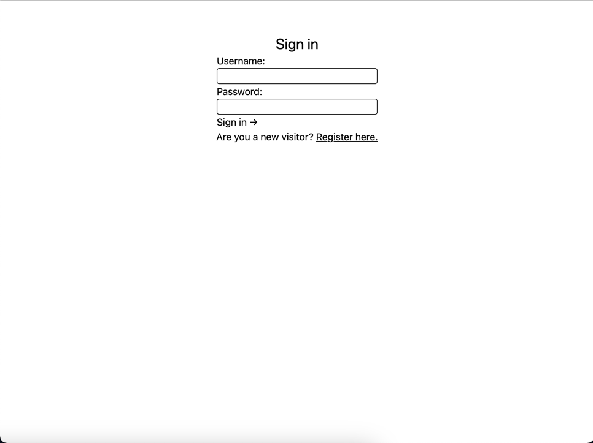
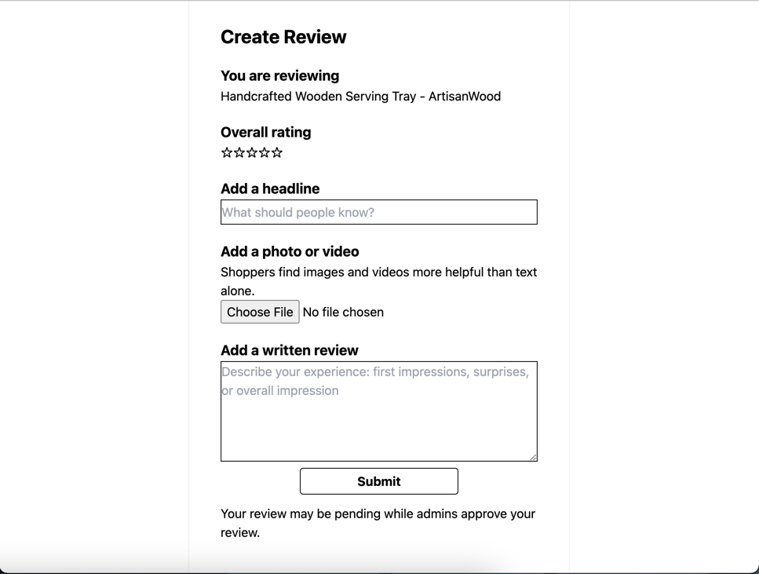
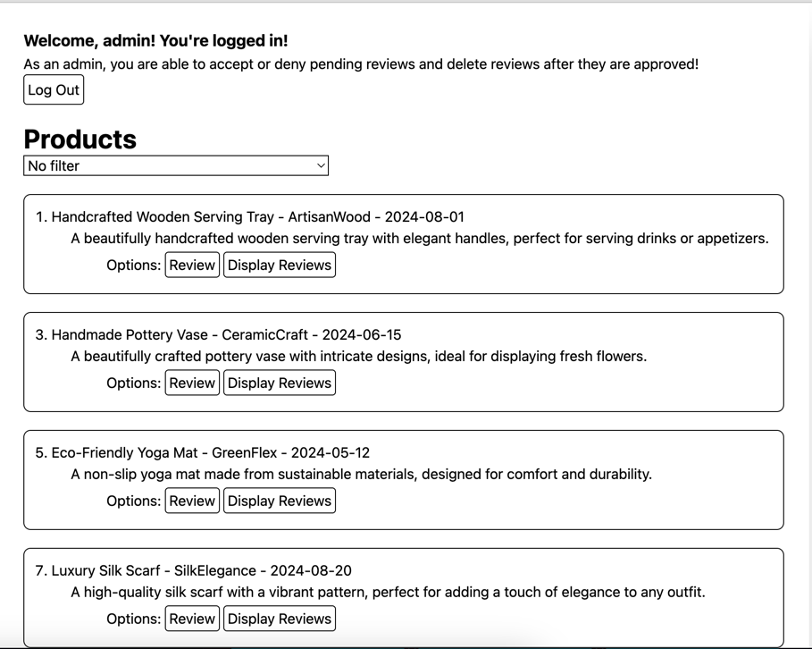
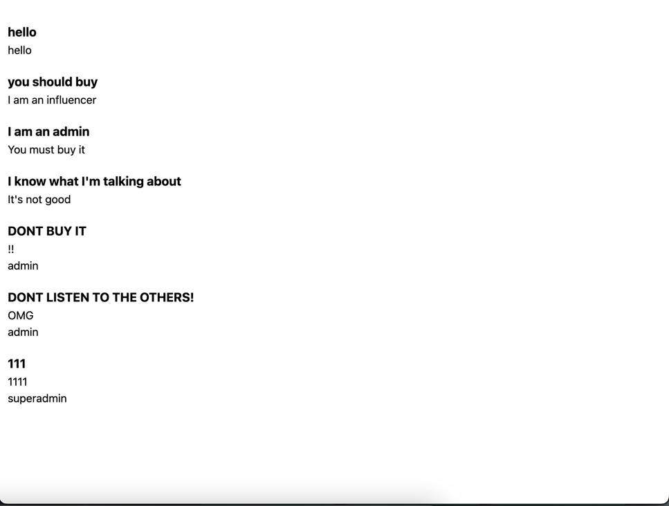
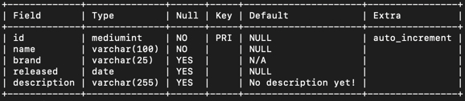
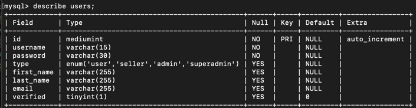
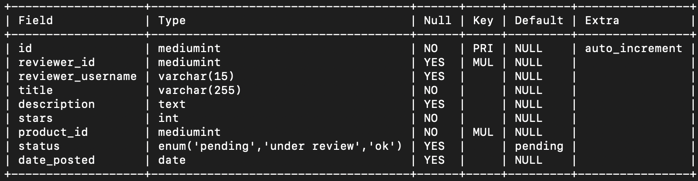
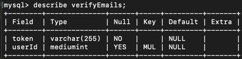

## Features
1. All routes are protected by Passport.js. If user is not logged in, they will be redirected to the login page and will not be able to communicate with the server.
2. After logging in, the user will stay logged in for 1 day (express-session library).
3. All reviews and users are saved to a MySQL database.

## Upcoming:
#### Account Privileges
1. Admins: accept or deny pending reviews.
2. Super admin: add, remove, or delete accounts.
3. Seller: add or remove products (only theirs).
#### Other
1. Magic Link Support.
2. Verify email after registering.
3. Flesh out reviews page.
4. Add products.
5. Add a notice board?
6. Give admins an unique identifier.

## Screenshots
#### Users are authenticated by server and database. New users are added to database.

#### Reviews are saved to database.

#### Products read from MySQL database.

#### Each product has its own reviews. Each review has a title, body, and the reviewer's username. Currently a work in progress.

### Database Schema
#### Products

#### Users

#### Reviews

#### Verified Emails (Work In Progress)

